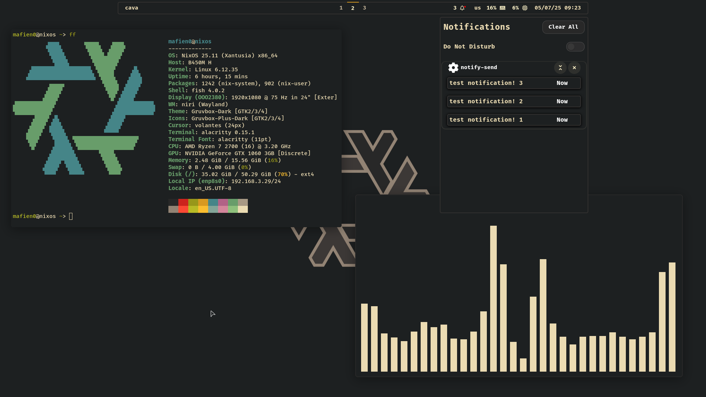

# Preview



# Intallation

### Recommend to fork this repository and change usernames to yours
inside of [flake.nix](https://github.com/Mafien01/NixOS-Config/blob/main/flake.nix)
> Dont forget to run `nix flake update` after changing flake

inside of [nixos/modules/user.nix](https://github.com/Mafien01/NixOS-Config/blob/main/nixos/modules/user.nix)

inside of [home-manager/home.nix](https://github.com/Mafien01/NixOS-Config/blob/main/home-manager/home.nix)

inside of [home-manager/modules/git/default.nix](https://github.com/Mafien01/NixOS-Config/blob/main/home-manager/modules/git/default.nix): name and mail

copy your `hardware-configuration.nix` into nixos/hardware-configuration.nix

and configure `nixos/modules/packages.nix` for your needs

and after, in instalation clone not my repository, but yours


### Clone repostory as ~/nix
```
git clone https://github.com/Mafien01/NixOS-Config ~/nix
```

### Rebuild nixos using ~/nix flake
```
sudo nixos-rebuild boot --flake ~/nix
```
### Switch home manager using ~/nix flake
```
home-manager switch --flake ~/nix
```

### Reboot


